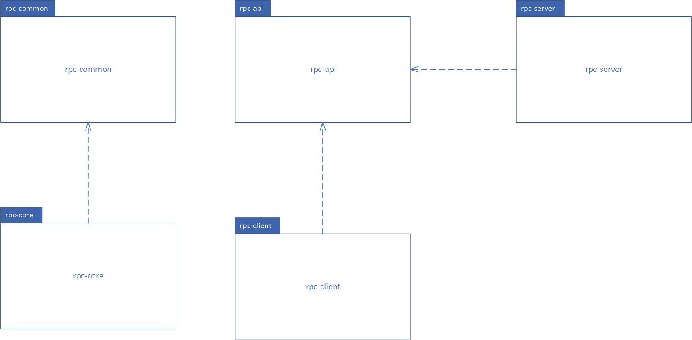

# 简易RPC框架
## 项目介绍
本项目是基于Nacos作为注册中心进行服务发现与注册并使用Netty作为远程调用的通信模块的一个简易RPC框架，实现了基本的远程调用功能；项目中自定义了网络协议并使用了Kryo序列化器对消息进行序列化与反序列化，使用了SPI扩展机制实现插件化配置，还使用了自定义注解来进行服务的注册与消费。
## 项目结构
> Tips: 需要自行下载Nacos服务端(此项目使用的版本为2.3.2)并启动才能运行项目

```txt
holo-rpc-framwork
    -|-> rpc-common # 公共模块：放置一些枚举常量、自定义异常、扩展加载类与工具类等
    -|-> rpc-core # 核心模块：包括使用Netty的远程通信模块、序列化器、服务发现与服务注册等功能均在此模块中
    -|-> rpc-api # 测试demo服务公共接口模块：定义服务接口
    -|-> rpc-client # 测试demo服务消费端模块：调用服务接口中的服务
    -|-> rpc-server # 测试demo服务提供端：实现服务接口中的服务并注册
    -|-> rpc-test # 自定义测试模块(与项目无关可删除)：自己测试Nacos等其它代码的地方，仅做测试用
```


## 技术栈

| 名称 | 版本 |
| --- | --- |
| SpringBoot | 2.7.17 |
| Netty | 4.2.0.Alpha1 |
| kryo | 5.5.0 |
| Nacos客户端 | 2.3.1 |
| lombok日志 | 1.18.20 |

## 自定义通信协议格式
```txt
 *   0     1     2     3     4        5     6     7     8         9          10      11     12  13  14   15 16
 *   +-----+-----+-----+-----+--------+----+----+----+------+-----------+-------+----- --+-----+-----+-------+
 *   |   magic   code        |version | full length         | messageType| codec|compress|    RequestId       |
 *   +-----------------------+--------+---------------------+-----------+-----------+-----------+------------+
 *   |                                         body                                                          |
 *   |                                        ... ...                                                        |
 *   +-------------------------------------------------------------------------------------------------------+
 * 4B  magic code（魔法数）   1B version（版本）   4B full length（消息长度）    1B messageType（消息类型）
 * 1B compress（压缩类型） 1B codec（序列化类型）    4B  requestId（请求的Id）
```